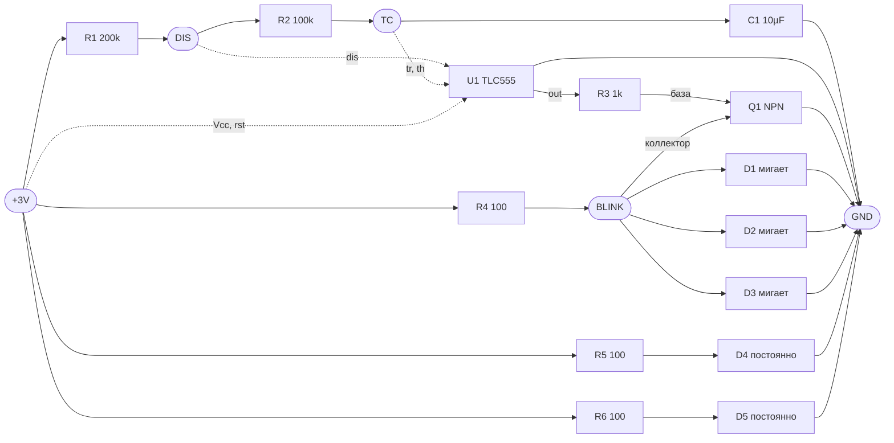

# S7 Badge for OFFZONE 2024

## Authors
- leitosama
- Unknown actor #2
- Unknown actor #3

## Design idea
- S7 Airplane with Siberian forest livery
- Airplane has air navigation lights like real planes

## Схема

`project/offzone-addon-s7.kicad_sch` — схема аэронавигационных огней, собранная по
референсному скриншоту из симулятора. До этого файл был пустой заготовкой: плата
содержала только контур и шелкографию, без футпринтов и цепей.

### Как это работает

Узел `BLINK` — это коллектор Q1. Пока `out` = 0, Q1 закрыт, R4 подтягивает `BLINK`
вверх и D1..D3 светятся. Когда `out` = 1, Q1 открывается и шунтирует `BLINK` на землю —
мигающие огни гаснут. D4 и D5 запитаны от +3V напрямую через R5/R6 и горят постоянно.

### Тайминги

| Параметр | Формула | Значение |
|---|---|---|
| `out` = 1 (огни погашены) | 0,693 · (R1 + R2) · C1 | 2,08 с |
| `out` = 0 (вспышка) | 0,693 · R2 · C1 | 0,69 с |
| Период | сумма | 2,77 с (≈ 0,36 Гц) |
| Скважность | — | 75 % |

Получается вспышка 0,69 с примерно каждые 2,8 с, то есть около 22 вспышек в минуту.

### Цепи

| Цепь | Выводы |
|---|---|
| `+3V0` | R1.1, R4.1, R5.1, R6.1, U1.4 (`/RESET`), U1.8 (`VCC`) |
| `GND` | C1.2, D1.1, D2.1, D3.1, D4.1, D5.1, Q1.2 (E), U1.1 (`GND`) |
| `DIS` | R1.2, R2.1, U1.7 (`DIS`) |
| `TC` | C1.1, R2.2, U1.2 (`/TR`), U1.6 (`THR`) |
| `BLINK` | Q1.3 (C), R4.2, D1.2, D2.2, D3.2 |
| — | U1.3 (`OUT`) → R3.1 |
| — | R3.2 → Q1.1 (B) |
| — | R5.2 → D4.2, R6.2 → D5.2 |
| — | U1.5 (`CONT`) — не подключён (no-connect) |

### BOM

| Поз. | Номинал | Корпус | LCSC | Примечание |
|---|---|---|---|---|
| U1 | LMC555M/TR | SOP-8 | C356725 | **CMOS**-таймер, см. замечание ниже |
| R1 | 200 кОм | 0603 | C25811 | задающая цепь |
| R2 | 100 кОм | 0603 | C25803 | задающая цепь |
| C1 | 10 мкФ | 0805 | C1713 | задающая цепь |
| R3 | 1 кОм | 0603 | C21190 | база Q1 |
| Q1 | КТ3153А9 | КТ-46А (SOT-23) | ChipDip | n-p-n, цоколёвка **1-К, 2-Б, 3-Э** |
| R4 | 100 Ом | 0603 | C105588 | общий токозадающий для D1..D3 |
| R5, R6 | 100 Ом | 0603 | C105588 | токозадающие для D4, D5 |
| D1..D3 | LED | 0805 | — | мигающие (строб / маяк) |
| D4, D5 | LED | 0805 | — | постоянные (БАНО) |

Конкретные светодиоды не выбраны: цвета — на ваше усмотрение. По-самолётному это
красный на левом крыле, зелёный на правом и белые стробы. В файле EasyEDA у D1..D5
подставлен корпус `LED0805`, партномер нужно назначить.

### Тот же проект для EasyEDA

`project/offzone-addon-s7-easyeda.json` — та же схема в формате EasyEDA Standard.
Открывается через **File → Open → EasyEDA**. Графика символов взята из библиотеки
LCSC и целиком встроена в файл, а партномера едут в атрибуте `BOM_Supplier Part`,
так что схему можно вести в плату.

`project/offzone-addon-s7-easyeda-sheet.json` — тот же лист без обёртки проекта
(один документ `docType: 1`). Запасной вариант, если проектный файл не открывается.

Отличия от KiCad-версии только в оформлении: цепи `+3V`, `GND`, `TC`, `DIS`, `OUT`,
`BLINK` разведены сетевыми метками, поэтому длинных перемычек вокруг корпуса U1 нет.
Список цепей совпадает с таблицей выше цепь в цепь.

> **Почему в компонентах пустые uuid.** Сначала в заголовки `LIB` были подставлены
> `uuid`/`puuid` библиотечных документов LCSC. При импорте EasyEDA пытается привязать
> эти документы к вашей учётной записи, они ей не принадлежат — и импорт падает с
> `Permissions Error`, создавая пустой лист. Поля оставлены пустыми, как в системной
> рамке листа; на геометрию и BOM это не влияет.

### Замечания к схеме со скриншота

1. **Таймер должен быть CMOS.** Биполярный NE555 требует минимум 4,5 В и от 3 В не
   заработает. Поставлен LMC555 (питание от 1,5 В); равноценны TLC555 и ICM7555.
   В симуляторе таймер идеальный, поэтому там это не проявляется.
2. **Потребление великовато для CR2032.** D4 и D5 берут по ~11 мА постоянно, а R4 при
   открытом Q1 сжигает ~29 мА вхолостую — в среднем около 46 мА. CR2032 (~220 мАч)
   такой ток не держит. Если питание автономное, стоит поднять R5/R6 до 1–2 кОм и
   перенести D1..D3 в коллекторную цепь Q1 (тогда R4 работает только во время вспышки).
3. **Вывод `ctl` оставлен свободным**, как на скриншоте. На реальной плате его обычно
   шунтируют конденсатором 10 нФ на землю.
4. **У КТ3153А9 своя цоколёвка.** По даташитам «Далекс» и ОАО «Интеграл» в корпусе
   КТ-46А (SOT-23) вывод 1 — коллектор, 2 — база, 3 — эмиттер. У западных SOT-23
   (MMBT3904, BC847) порядок другой: 1 — база, 2 — эмиттер, 3 — коллектор. Посадочное
   место нужно нумеровать по даташиту, иначе транзистор включится «наизнанку».
   По параметрам запас большой: Iк max 400 мА против рабочих ~30 мА, h21э 100…300 —
   базового тока (3 В − 0,85 В)/1 кОм ≈ 2 мА хватает для насыщения с большим запасом.

### Что осталось сделать

- Футпринты компонентам не назначены — цепи в `.kicad_pcb` ещё не разведены.
- Источник питания в схеме не нарисован: +3V приходит либо с хост-бейджа через разъём
  аддона, либо от CR2032. Разъём/держатель нужно добавить отдельно.
